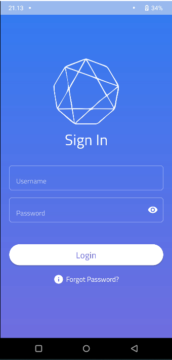

# Gaib University

Sistem Informasi Akademik Universitas berbasis Mobile.

MVVM Arch.

## Tools
- Kotlin
- Retrofit2
- Coroutines
- Room
- Firebase  (Soon)
- Material Design
- Slim 4 (Restful API)

## 
<!-- 

  
  
  
  

 -->
